# CATABLOG - A Community Blog Platform


### Live Link:

💻 [CATABLOG](https://pp4-dv3w.onrender.com)

## Table of Contents

- [About the Project](#about-the-project)
- [Features](#features)
- [User Stories](#user-stories)
- [Technologies Used](#technologies-used)
- [Deployment](#deployment)
- [Validation](#validation)
- [Testing](#testing)
- [Database](#database)
- [Wireframes](#wireframes)
- [Future Enhancements](#future-enhancements)
- [Acknowledgments](#acknowledgments)

---

## About the Project

CATABLOG is a full-stack web application designed as a blogging platform for cat lovers. Users can browse blog posts, leave comments, and create their own posts with images. The application demonstrates modern web development practices with user authentication and role-based permissions.

## Features

- User authentication (register, login, and logout).
- Create, edit, and delete posts (authenticated users only).
- Comment system with edit and delete options for the comment owner.
- Responsive design for desktop and mobile devices.
- Contact form with validation and success confirmation.

## User Stories

### As a Visitor

1. **Home Page**: I want to access a welcoming homepage that provides an overview of the application's functionality.
2. **Blog**: I want to view a list of all published blog posts so that I can easily find articles of interest.
3. **Read Article**: I want to click on a blog post to read its full content along with any associated comments.
4. **About Page**: I want to read more about the application and its purpose on a dedicated information page.
5. **Contact**: I want to fill out a contact form to send messages or inquiries to the application's administrator.
6. **Contact Confirmation**: I want to see a success message after submitting a contact form so that I know my message has been received.

### As a Registered User

1. **Create Post**: I want to create new blog posts and upload images to share my thoughts with others.
2. **Comment**: I want to add comments to a blog post to participate in discussions.
3. **Edit Comment**: I want to edit my own comments to correct mistakes or update my thoughts.
4. **Delete Comment**: I want to delete my own comments if I no longer want them to be visible.
5. **Authentication**: I want to register an account and log in to access personalized functionality.
6. **Logout**: I want to log out of my account securely after using the application.

### As an Administrator

1. **Role Management**: I want to manage user roles and permissions to ensure only authorized users access restricted functionality.
2. **Moderation**: I want to oversee and manage content such as blog posts and comments to maintain quality and security.

##### Back to [top](#table-of-contents)<hr>


## Technologies Used

### Front-End

- HTML5
- CSS3
- Bootstrap

### Back-End

- Python 3
- Django Framework

### Database

- SQLite (Development)

### Others

- Git and GitHub (Version control)
- Render (Deployment)

##### Back to [top](#table-of-contents)<hr>

## Deployment

### Overview
The application has been deployed using **Render**, a reliable and scalable cloud hosting platform. Render simplifies the deployment process and ensures that the application remains accessible to users at all times.

### Steps to Deploy on Render
1. **Set Up the Repository**:
   - Ensure your project is hosted on a version control platform like GitHub.
   - Push all necessary files, ensuring no sensitive information is included in the repository.

2. **Create a New Web Service on Render**:
   - Log in to [Render](https://render.com).
   - Click on "New Web Service" and connect your GitHub repository.
   - Select the branch for deployment and configure the build settings.

3. **Configure the Environment**:
   - Add necessary environment variables in Render's settings, such as:
     - `DATABASE_URL` for the PostgreSQL database connection.
     - `SECRET_KEY` for Django security.
   - Ensure `DEBUG` is set to `False` for production.

4. **Install Dependencies**:
   - Render will automatically detect the Python environment and install dependencies from the `requirements.txt` file.

5. **Run Migrations**:
   - In the Render dashboard, use the "Shell" feature or deployment commands to apply migrations:
     ```
     python manage.py migrate
     ```

6. **Collect Static Files**:
   - Ensure static files are collected for the live environment:
     ```
     python manage.py collectstatic
     ```

7. **Start the Application**:
   - Once deployment is complete, the application will be accessible via the Render-provided URL.

### Live Link
The application is live and accessible at: [Your Deployed Application URL](#)

### Additional Notes
- **Debugging**: If any deployment issues arise, the Render dashboard provides logs to help identify and resolve errors.
- **Updates**: Pushing new commits to the connected branch will automatically trigger a new deployment.

##### Back to [top](#table-of-contents)<hr>


## Validation

### HTML Validation

W3C was used for validating html code

## Validation

### HTML Validation

W3C was used for validating html code

<details>
  <summary>home.html</summary>
  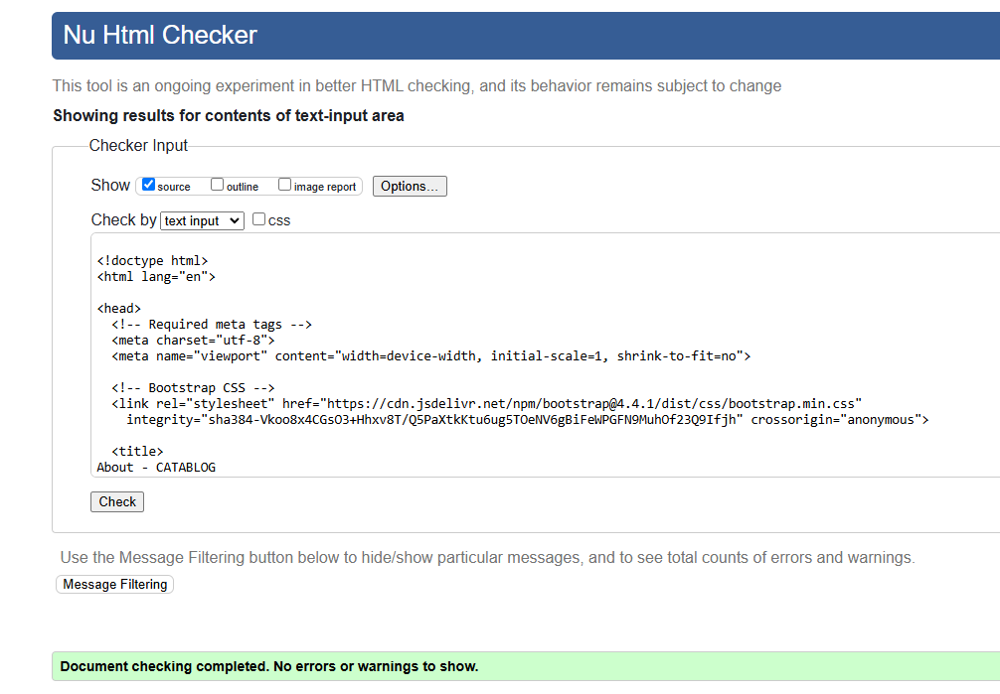
</details>
<hr>
<details>
  <summary>about.html</summary>
  
</details>
<hr>
<details>
  <summary>base.html</summary>
  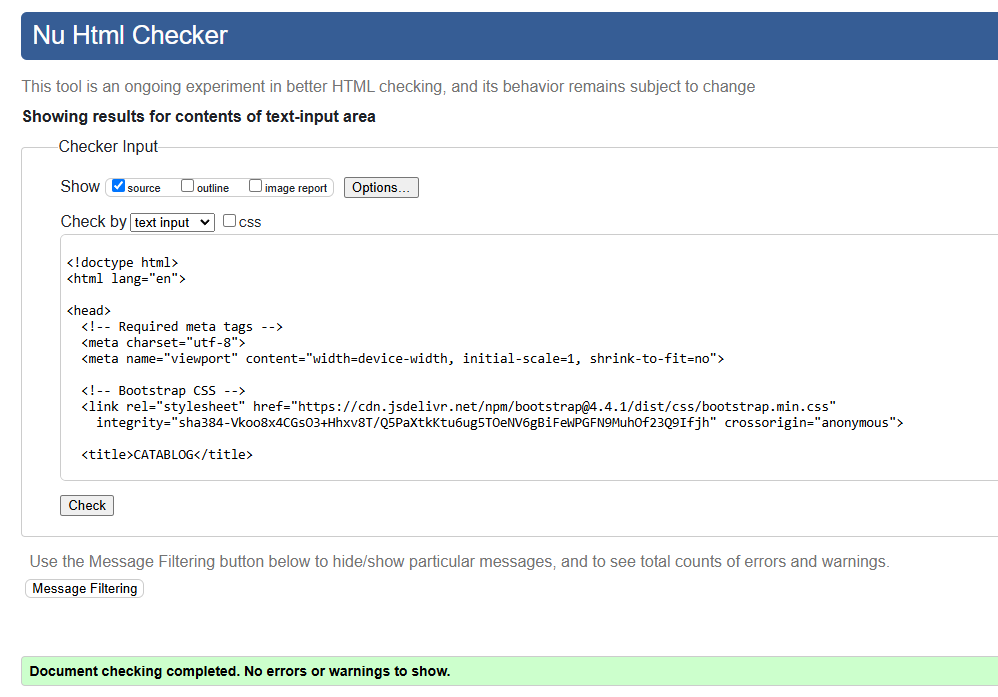
</details>
<hr>
<details>
  <summary>blog.html</summary>
  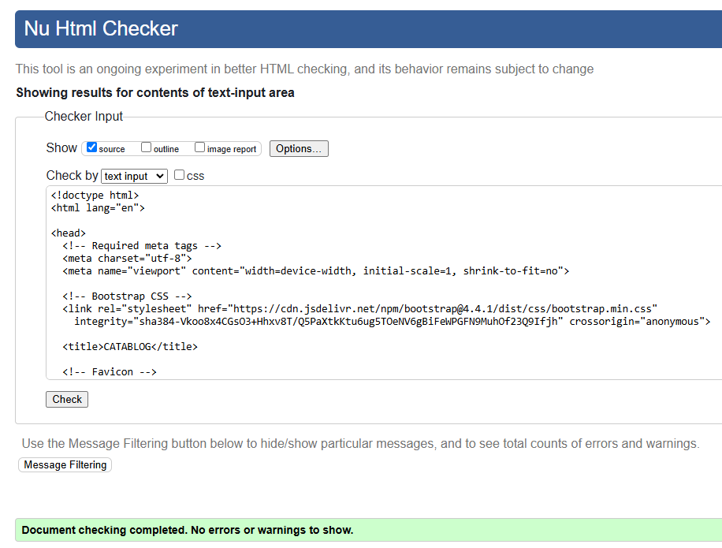
</details>
<hr>
<details>
  <summary>contact.html</summary>
  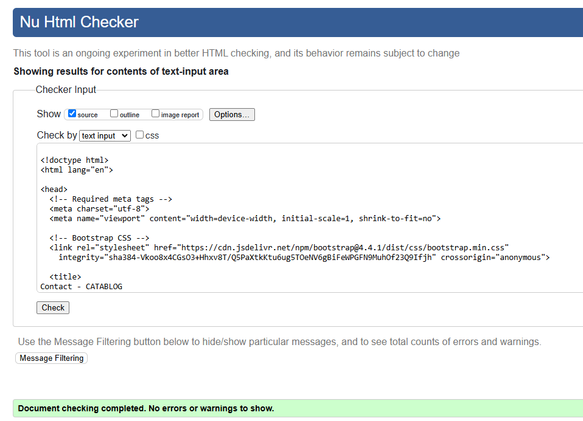
</details>
<hr>
<details>
  <summary>detail_view.html</summary>
  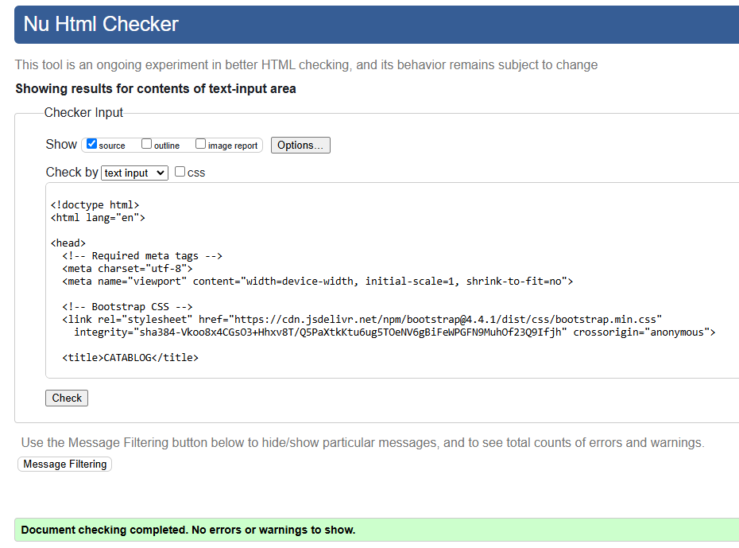
</details>
<hr>
<details>
  <summary>login.html</summary>
  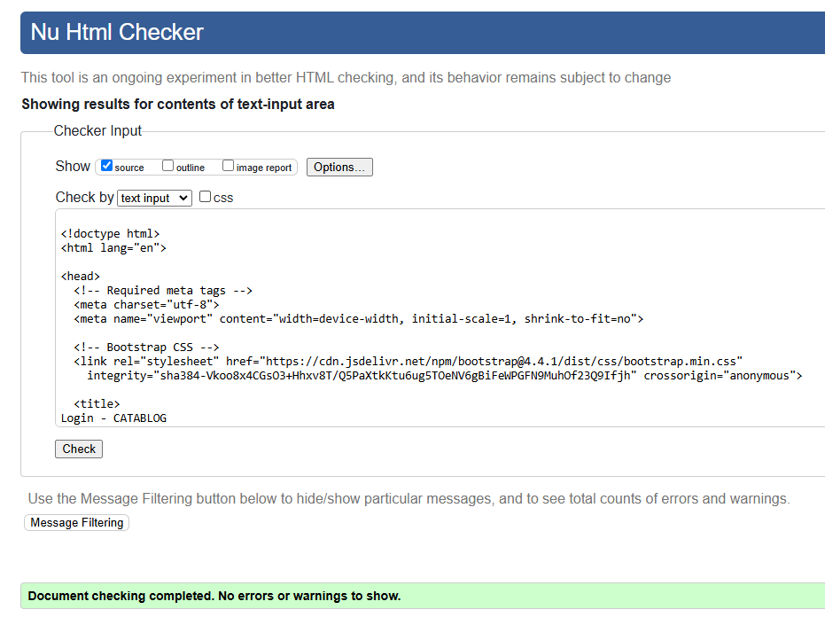
</details>
<hr>
<details>
  <summary>register.html</summary>
  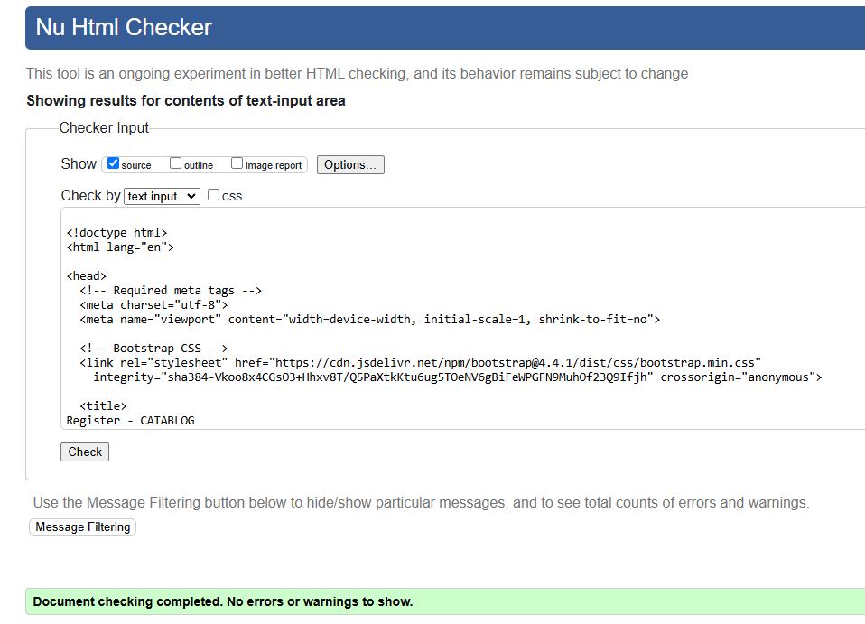
</details>
<hr>
<details>
  <summary>delete.html</summary>
  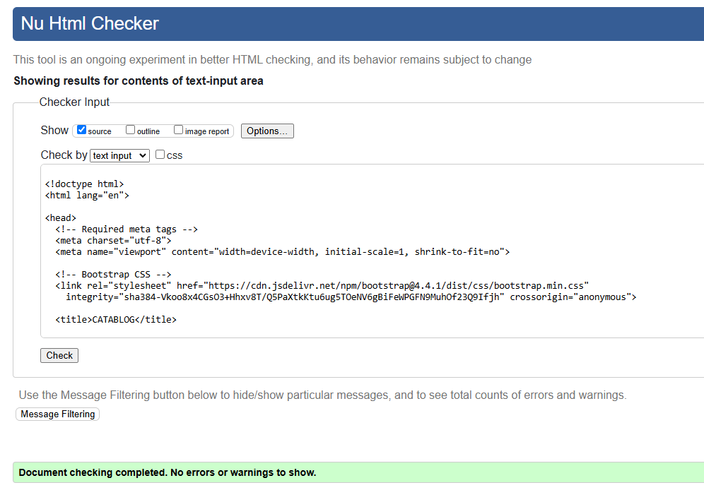
</details>
<hr>
<details>
  <summary>edit.html</summary>
  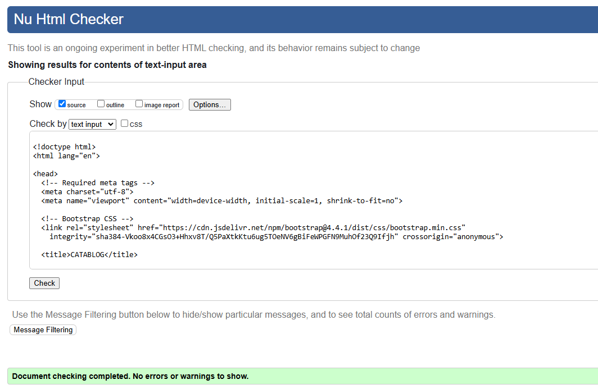
</details>
<hr>

##### Back to [top](#table-of-contents)<hr>

### CSS Validation

The W3C Jigsaw CSS Validation Service

<details><summary>style.css</summary>
  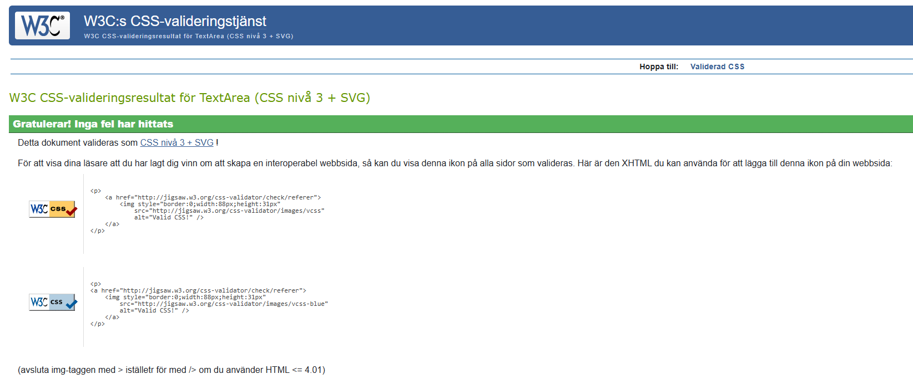</a>
</details><hr>

### PEP8 Validation

Service was used to check the Python code. To ensure that all Python code adheres to the PEP 8 style guide, the following steps were:

#### Ran `pycodestyle` in the terminal to identify PEP 8 violations.

<details><summary>Running pycodestyle .</summary>
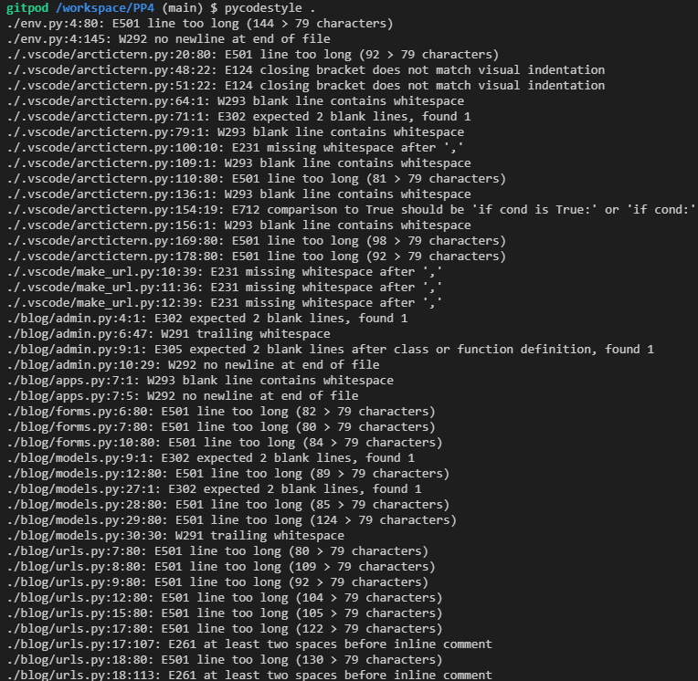
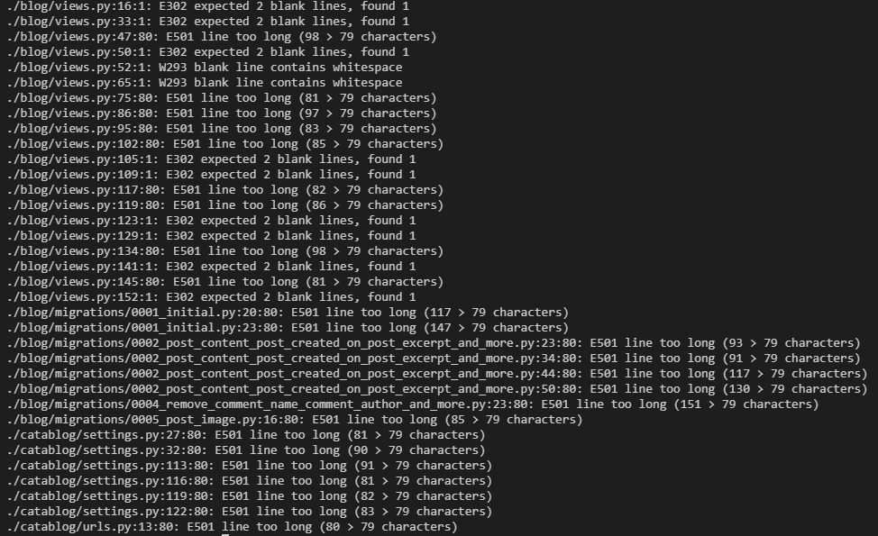
</details>
<hr>

#### Automated fixes running `autopep8 --in-place --aggressive --aggressive **/*.py`
<details><summary>Running autopep8 --in-place --aggressive --aggressive **/*.py</summary>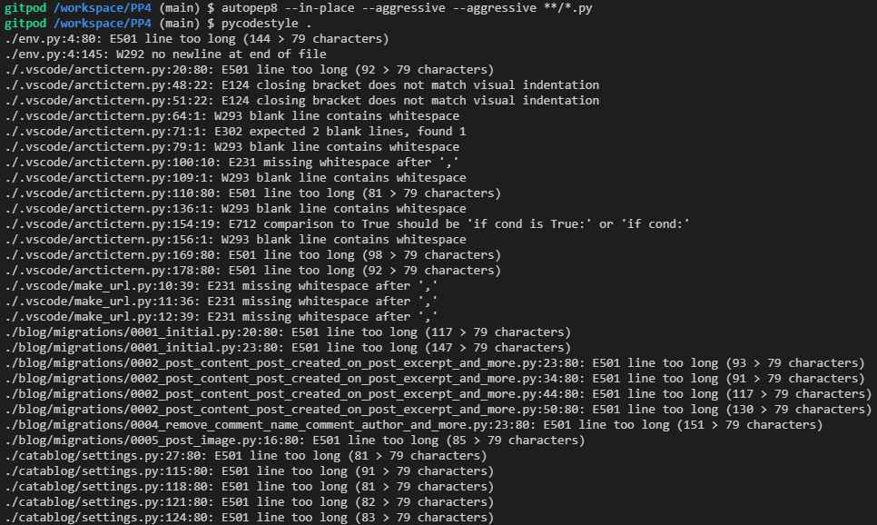</details><hr>

#### Manually corrected remaining issues, including:
   - Line length exceeding 79 characters.
   - Missing blank lines between class or function definitions.
   - Duplicates in `INSTALLED_APPS` in the Django settings.
<details><summary>Manual fix</summary>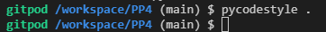</details><hr>

##### Back to [top](#table-of-contents)<hr>


## Testing

This project was validated and tested manually to ensure full functionality, usability, responsiveness, and proper data management.

### Manual Test Cases
The following aspects of the application were thoroughly tested:

1. **Navigation:**
   - Ensured all links navigate to the correct pages.
   - Checked the responsiveness of the navbar on mobile, tablet, and desktop views.

2. **Form Validation:**
   - Tested all forms with valid and invalid inputs.
   - Verified error messages appear when invalid data is submitted.

3. **User Authentication:**
   - Registered new users, logged in, logged out, and reset passwords.

4. **Database Management:**
   - Created, read, updated, and deleted records in the database using the admin panel and the front-end interface.

### Validation Tools
The following tools were used to validate the application:
- **Pycodestyle:** Ensured PEP 8 compliance.
- **HTML Validator:** Validated the HTML structure.
- **CSS Validator:** Checked CSS styles for errors and warnings.

All test cases passed successfully, ensuring the application works as expected.

##### Back to [top](#table-of-contents)<hr>

## Database

### Overview
The application uses a **cloud-hosted PostgreSQL database**, configured through an environment variable for secure and flexible deployment. This setup ensures a scalable and production-ready database that can handle increasing amounts of data and user interactions.

### Models
The database is structured using Django models to maintain a relational structure. Below are the key models and their attributes:

#### **Post**
- `title`: Title of the post (CharField, max_length=200)
- `slug`: URL-friendly representation of the title (SlugField, unique)
- `author`: Linked to the `User` model (ForeignKey)
- `content`: Text content of the post (TextField)
- `image`: Optional image for the post (ImageField)
- `created_on`: Timestamp when the post was created (DateTimeField, auto_now_add)
- `updated_on`: Timestamp when the post was last updated (DateTimeField, auto_now)

#### **Comment**
- `post`: Linked to the `Post` model (ForeignKey)
- `author`: Linked to the `User` model (ForeignKey)
- `body`: Text content of the comment (TextField)
- `created_on`: Timestamp when the comment was created (DateTimeField, auto_now_add)
- `approved`: Boolean to indicate if the comment is approved (default=True)

### Database Features
1. **Relational Structure**: Models are interconnected using ForeignKeys to ensure a normalized database schema.
2. **Automatic Migrations**: Django migrations are used to manage database schema changes seamlessly.
3. **Scalability**: While SQLite is used for development, the application can easily switch to PostgreSQL in production with minimal configuration changes.

### Configuration
The database is configured in `settings.py` to dynamically parse the database connection string from an environment variable. This approach enhances security and deployment flexibility.

##### Back to [top](#table-of-contents)<hr>

## Wireframes

### Overview
The wireframes were created during the planning phase to visualize the design and layout of the application. They served as a blueprint for implementing the user interface, ensuring the design met accessibility and usability standards. The wireframes for this project were created using **Uizard.io**.

### Home Page
- **Purpose**: Serves as the landing page for users visiting the site. Provides a welcoming introduction to the platform.
- **Features**:
  - A welcoming heading ("Welcome to CATABLOG").
  - A call-to-action button leading to the blog page.
  - Responsive design for both desktop and mobile users.
<details><summary>Home</summary>
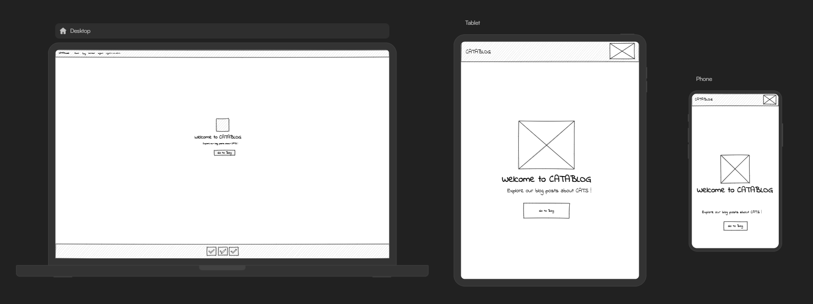
</details>
<hr>

### About Page
- **Purpose**: Explains the platform's mission and vision to users.
- **Features**:
  - A clean and informative design to enhance readability.
  - A brief introduction about the platform and its goals.
  - Fully responsive for various devices.
<details><summary>About</summary>
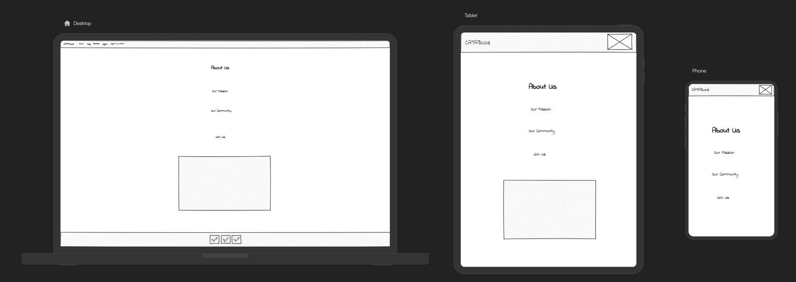
</details>
<hr>

### Blog Page
- **Purpose**: Displays a list of posts created by users, with the ability to add new posts if logged in.
- **Features**:
  - Shows all posts in a card layout with a title, truncated content, and an optional image.
  - "Read More" links to detailed views of posts.
  - Authenticated users can create posts, including uploading images.
  - Pagination for better user experience with larger datasets.
<details><summary>Blog</summary>
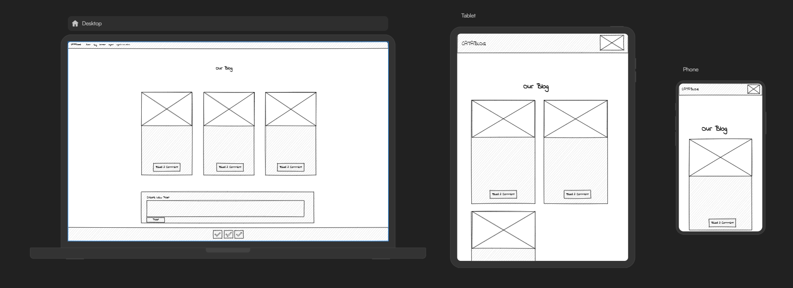
</details>
<hr>

### Login Page
- **Purpose**: Allows users to log in and access restricted features such as posting or commenting.
- **Features**:
  - Simple and user-friendly form for username and password.
  - Displays feedback messages for successful or unsuccessful login attempts.
  - "Remember Me" option for user convenience.
<details><summary>Login</summary>
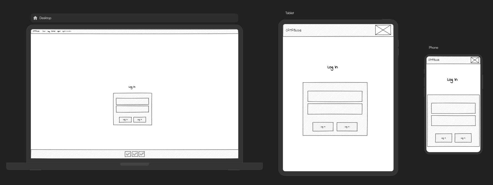
</details>
<hr>

### Register Page
- **Purpose**: Enables new users to create an account on the platform.
- **Features**:
  - Form fields for username, email, password, and password confirmation.
  - Validates input and provides error messages for invalid fields.
  - Redirects to the login page after successful registration with a success message.
<details><summary>Register</summary>
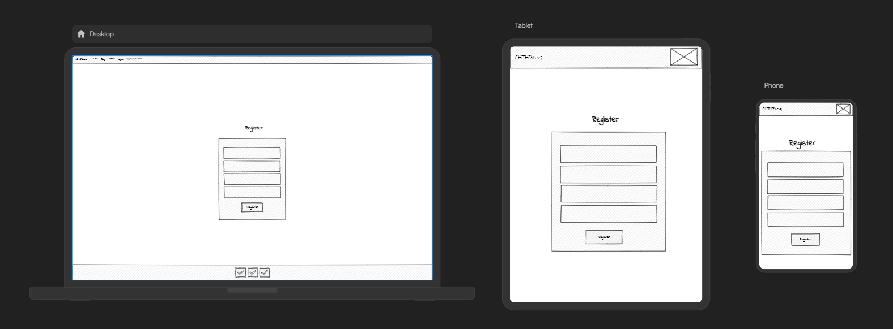
</details>
<hr>

### Contact Page
- **Purpose**: Allows users to send messages or queries to the platform's administrator.
- **Features**:
  - Form fields for first name, last name, email, subject, and message.
  - Validates input fields before submission.
  - Displays a success message upon form submission.
<details><summary>Contact</summary>
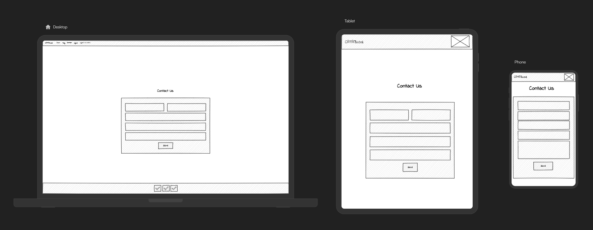
</details>
<hr>

##### Back to [top](#table-of-contents)<hr>

## Future Enhancements

### 1. User Profile Management
- **Purpose**: Provide users with personalized experiences.
- **Proposed Features**:
  - Enable users to update their profile information, such as bio and profile picture.
  - Display user-specific dashboards showing their posts and comments.

### 2. Post Categories and Tags
- **Purpose**: Improve content organization and discoverability.
- **Proposed Features**:
  - Add categories or tags to posts.
  - Allow users to filter or search posts by category or tag.

### 3. Social Media Integration
- **Purpose**: Increase platform visibility and user engagement.
- **Proposed Features**:
  - Enable social media sharing for blog posts.
  - Allow users to log in using social media accounts.

### 4. Search Functionality
- **Purpose**: Make it easier for users to find specific content.
- **Proposed Features**:
  - Add a search bar to the blog page for finding posts by title, author, or content.

### 5. Mobile App
- **Purpose**: Increase accessibility and user engagement.
- **Proposed Features**:
  - Develop a mobile app version of the platform.
  - Incorporate push notifications for updates and interactions.

##### Back to [top](#table-of-contents)<hr>


## Acknowledgments

- **Student Support Team**: A heartfelt thank you to the Student Support team for their unwavering assistance and encouragement throughout the project. Your guidance made a significant difference in overcoming challenges and achieving success.
